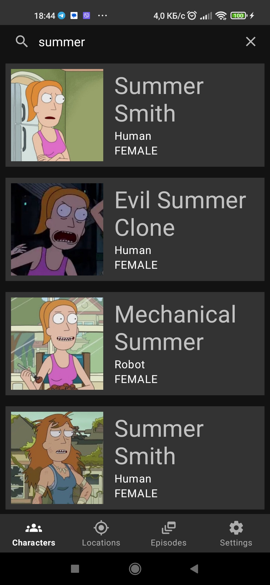
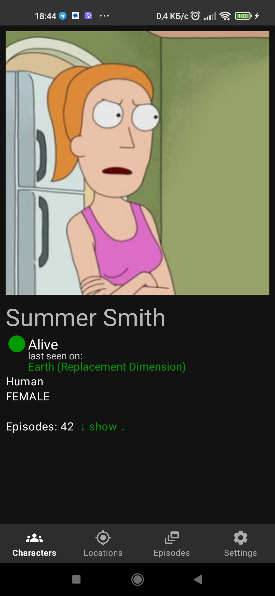
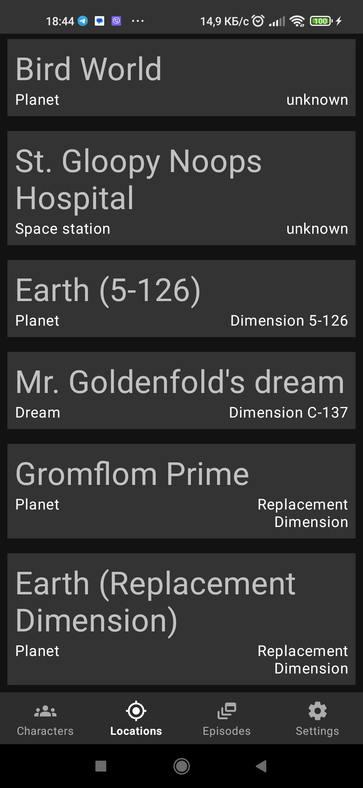
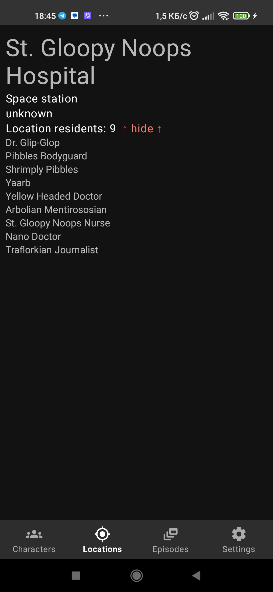
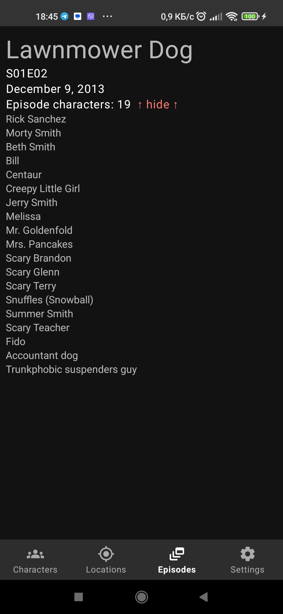
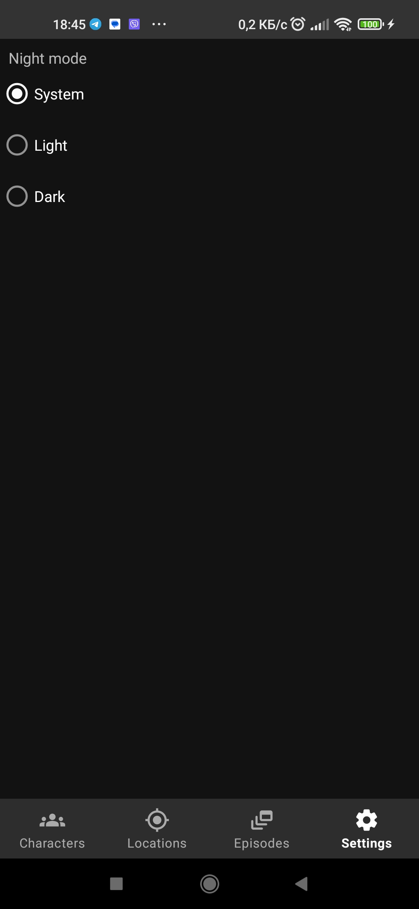
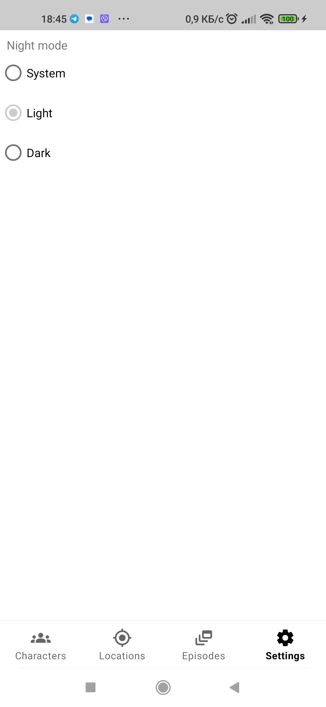
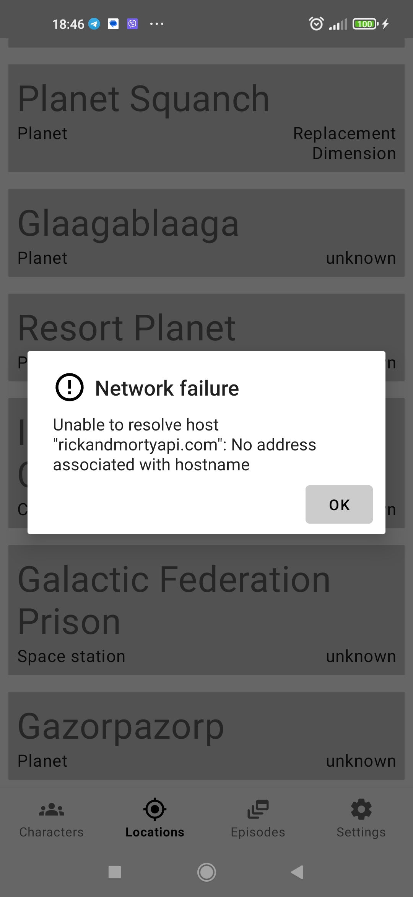

# Rick and Morty

## Описание

Приложение позволяет посмотреть данные по героям, локациям и эпизодам небезысвестного мультсериала
"Rick and Morty". Для первичной загрузки даных требуется интернет, в дальнейшем возможна автономная работа.
Используются данные открытого API: <https://rickandmortyapi.com/>

## Скриншоты

## Используемые библиотеки и технологии
#### Паттерны:
* Clean Architecture
* MVVM
#### Навигация:
* Navigation Component
#### Внедрение зависимостей:
* Dagger 2
#### Базы данных:
* Room
#### Сеть и изображения:
* Retrofit
* Glide
* Kotlinx Serialization
#### Прочее:
* Coroutines
* Flow
* 